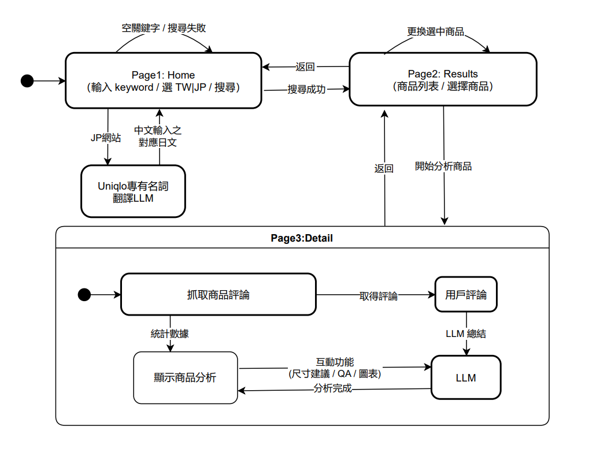

# UNIQLO 評論洞察 Agent（TW/JP）

以動態爬蟲，將 UNIQLO 台灣/日本站的評論統一格式化並用 LLM 做中文摘要與 QA。介面採用 Streamlit。

---

## 快速開始

1. 環境

- Python 3.10+（建議虛擬環境）
- 主要套件：`streamlit`, `requests`，以及你的動態爬蟲依賴（如 crawl4ai / Playwright）
- 已整理依賴於 `requirements.txt`（含 Streamlit、crawl4ai、BeautifulSoup、Pillow、pandas...）。
- 瀏覽器（Streamlit 自動開啟）

2. 安裝

```bash
pip install -r requirements.txt
```

3. 環境變數

```env
OLLAMA_API_KEY=your_api_key_here
```

執行應用時會自動讀取。

3.1 macOS / Linux（bash / zsh）
將以下內容加入 `~/.bashrc` 或 `~/.zshrc`：

```bash
export OLLAMA_API_KEY="your_api_key_here"
```

執行以下命令使設定生效：

```bash
source ~/.bashrc
# 或
source ~/.zshrc
```

3.2 Windows（PowerShell）

用系統環境變數（需要系統管理員權限）：

```powershell
setx OLLAMA_API_KEY "your_api_key_here"
```

⚠️ **設定後請重新開啟終端機或 VS Code 使環境變數生效。**

4. 執行

```bash
streamlit run app.py
```

瀏覽器操作：選地區（TW/JP）→ 輸入關鍵字 → 選模型 → 搜尋 → 查看摘要/QA。

---

## 功能特色

- **TW/JP 支援**：依地區搜尋不同評論，給使用者更詳細的分析。

- **中文摘要與 QA**：重點摘要、尺寸/版型線索、使用者提問回覆。

- **套件使用**：爬蟲採用 crawl4ai+ BeautifulSoup 輔助解析；UI 採用 Streamlit。

---

## 專案結構

```text
├── app.py            # Streamlit UI 入口
├── getComment_jp.py  # 日本站評論爬蟲
├── getComment_tw.py  # 台灣站評論爬蟲
├── wedSearch.py      # 搜尋與列表解析
├── uniqlo.png        # UI logo
└── state.png         # 流程圖
```

---

## 模型選擇建議

可於程式碼中編輯選

- `gpt-oss:120b`：最高品質，較慢，適合最終產出與嚴謹 QA。
- `gpt-oss:20b`：品質/速度平衡，預設值。
- `gemma3:4b`：最快、最省資源，適合快速預覽；翻譯日文時會自動使用此最快模型。

實際速度/品質取決於硬體。

---

## 執行流程（State Diagram）

1. 使用者輸入關鍵字與地區。
2. 搜尋商品頁
3. 解析商品列表 → 進入評論頁 → 抽取/轉 JSON。
4. 統一評論 JSON → 交給 LLM 摘要/QA。



---

## 評論爬蟲輸出格式（簡化）

```json
{
  "site": "uniqlo_jp",
  "product_url": "https://www.uniqlo.com/jp/ja/products/E464918-000/00",
  "review_count": 120,
  "reviews": [
    { "title": "履き心地が良い", "content": "...", "user_info": "男性50代" }
  ],
  "llm": { "summary_zh": "...", "qa_zh": "..." }
}
```

---

## FAQ

- **為什麼要分 TW/JP？** 兩站頁面結構與評論量差異大，故分開寫。
- **LLM 失敗怎麼辦？** 請檢查 `OLLAMA_API_KEY` 或遠端服務狀態。
- **網站改版抓不到？** 需更新 `wedSearch.py`、`getComment_tw.py`、`getComment_jp.py` 的 selector/解析規則。

---

## 注意事項
